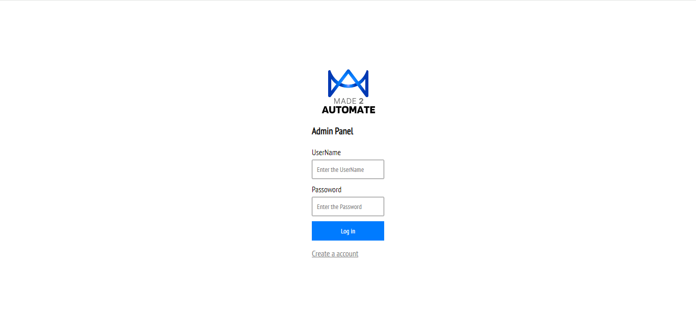

# Admin Panel Project

This project is an admin panel for managing products, companies, and user authentication.

## Table of Contents
- [Features](#features)
- [Screenshots](#screenshots)
- [Setup](#setup)
- [Usage](#usage)
- [Technologies](#technologies)

## Features
1. **User Authentication:**
   - Login and Sign Up pages with validation.
   - Logout functionality to securely sign out.

2. **Dashboard:**
   - Home page with a dashboard showing total products, stocks, and revenue.

3. **Add Product:**
   - Add Product page with a form to add new products.
   - Product image preview and barcode generation.

4. **List Product:**
   - List of companies to list your products.

## Components
###Login 
The Login page is used to log in the user with right credentials.

###Sign 
The sign Page is used to create the new account for the user

##Home 
The Home shows the dashboard , Product list ,total stocks,Revenue,total Product 

##Add Product 
The product is used to add the product with image preview.

##list Product
The list product is used to list the product to other online site

## Setup
1. Clone the repository.
2. Install dependencies using `npm install`.
3. Start the application using `npm start`.

## Usage
- Open your browser and navigate to `http://localhost:3000`.
- Log in using your credentials or sign up if you're a new user.
- Explore different pages: Home, Add Product, List Product, Logout.

## Technologies
- React.js
- React Router
- CSS for styling
